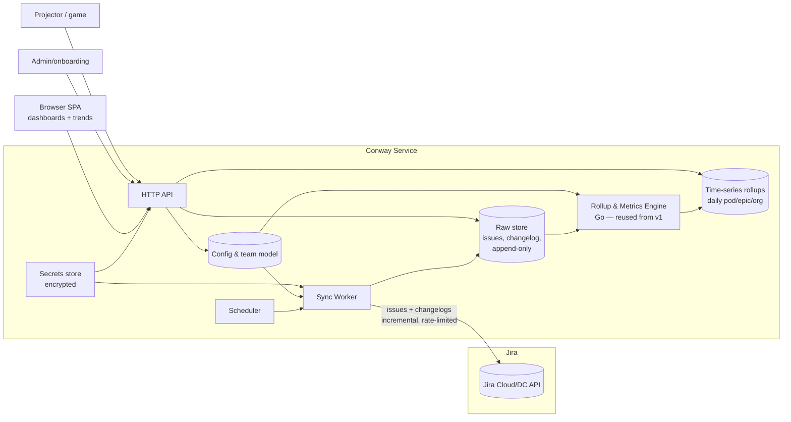

# Conway v2 — Technical Architecture

**Status:** Draft for review · **Date:** 2026-06-19 · **Companion:** [`v2-spec.md`](./v2-spec.md) (the *what/why*).

This is the *how*. It assumes the requirements in the spec and records the key technical
decisions as ADRs (§13).

---

## 1. Context & the load-bearing insight

Conway v1 = one-shot crawl → static JSON → point-in-time SPA. v2 must be a **continuous
historian**. The single fact that shapes the whole design:

> **You cannot re-scrape the past.** Jira's API returns *current* state plus each issue's
> **changelog**. To know what flow looked like 90 days ago you must either (a) snapshot
> forward from install, or (b) reconstruct the past from changelogs. Conway chooses (b)
> as the backbone and (a) as a fast-read cache. Changelogs also unlock *measured* flow
> (time-in-status, flow efficiency, aging) that v1 could only approximate.

Everything below follows from "ingest changelogs, keep raw as source of truth, derive
everything else, and recompute when definitions change."

## 2. High-level architecture



Components:
- **Scheduler** — triggers syncs (cron-like); also on-demand "sync now."
- **Sync Worker** — incremental Jira pull (issues + changelogs), idempotent, rate-limit-aware.
- **Raw store** — append-only issues + changelog events; the source of truth.
- **Rollup & Metrics Engine** — the v1 Go engine, parameterized; runs per sync, writes rollups.
- **Time-series rollups** — point-in-time derived metrics for fast trend queries.
- **Config & team model** — per-tenant settings (Jira target, field map, team directory, knobs).
- **API** — serves the SPA, admin, and game; reads rollups/raw/config.
- **Secrets store** — encrypted Jira tokens + signing keys.
- **SPA** — the existing dashboards + new trend views.

## 3. Sync design

```mermaid
sequenceDiagram
  participant S as Scheduler
  participant W as Sync Worker
  participant J as Jira
  participant R as Raw store
  S->>W: trigger (tenant, projects)
  W->>R: read last watermark (per project)
  loop paginated, rate-limited
    W->>J: search issues updated >= watermark
    J-->>W: page (issues + fields + links)
    W->>J: fetch changelog for changed issues
    J-->>W: changelog events
    W->>R: upsert issues; append new changelog events
    W->>W: backoff on 429; checkpoint watermark
  end
  W->>R: commit watermark = max(updated) this run
  W->>W: enqueue rollup recompute for affected window
```

- **Backfill vs incremental:** first run backfills the configured projects (bounded by a
  start date); subsequent runs use `updated >= lastSync` watermark per project.
- **Idempotency:** issues are upserted by key; changelog events keyed by (issue, eventId)
  so re-fetch never duplicates. Watermark only advances on durable commit (R-SYNC-4/5).
- **Rate limits:** token-bucket client with exponential backoff on 429; sync slows rather
  than fails (NFR-RATE). Large tenants batch by project and page size.
- **Freshness:** every run writes a `syncs` health row; the UI shows "last successful sync."

## 4. Data model (illustrative)

Raw (source of truth, append-only / upsert):
- `issues(tenant, key, project, type, status, status_category, assignee, pod, points, created, resolved, updated, due, labels, raw_json)`
- `changelog(tenant, issue_key, event_id, at, field, from_status, to_status, from_val, to_val)`
- `links(tenant, from_key, to_key, type)` — blocking links
- `epics(tenant, key, name, due, has_outcome, ...)` — derived epic metadata

Config (per tenant):
- `tenants(id, jira_base, auth_ref, ...)`
- `field_map(tenant, pod_field, points_field, ...)`
- `pods(tenant, name, site, tz, dev_count, pairing, is_sre, area)`
- `model_params(tenant, key, value, version, effective_from)`

Derived / time-series (recomputable from raw):
- `daily_pod_metrics(tenant, date, pod, wip_active, wip_waiting, load, cycle_p50, cycle_p85, throughput, morale_proxy, hygiene, interrupt_proxy, ktlo_proxy, def_version)`
- `daily_org_metrics(tenant, date, flow_index, constraint_pod, ktlo_share, ...)`
- `edges_snapshots(tenant, date, from_pod, to_pod, count)` — dependency graph over time
- `epic_snapshots(tenant, date, epic, pct_complete, buffer_consumed, due_status)`
- `syncs(tenant, started, ended, issues, errors, rate_limited, watermark)`

History strategy: rollups are a **cache** derived from raw + changelog. WIP/status on any
past date is reconstructed by replaying changelog events up to that date. Each rollup row
carries `def_version` so a definition change (R-HIST-4) triggers a recompute and the series
stays self-describing.

## 5. Metrics engine

Reuse the v1 Go engine (`server/game` + the sim logic) as a library:
- Inputs become **queries over raw/changelog**, not static JSON.
- Same formulas (load, Kingman, percentiles, constraint score, hygiene, full-kit, buffer),
  plus changelog-derived measured metrics (R-MET-2).
- A `recompute(tenant, window, def_version)` entry point rebuilds rollups from raw — used on
  config change and for backfilled history.

## 6. API surface (sketch)

```
POST /api/tenants/:t/sync            # trigger sync (admin)
GET  /api/tenants/:t/freshness       # last sync, health
GET  /api/tenants/:t/pods            # current pod metrics
GET  /api/tenants/:t/trends?metric=&pod=&from=&to=   # time-series
GET  /api/tenants/:t/network?date=   # dependency graph at a date
GET  /api/tenants/:t/epics           # epic forecasts / fever
GET  /api/tenants/:t/hygiene         # hygiene + drill
POST /api/tenants/:t/config          # admin: field map, pods, params
GET  /api/leaderboard  POST /api/game/*   # carried over from v1
```
Auth: bearer token (as v1), tenant-scoped, role-gated. Single-tenant deploy can pin `:t`.

## 7. Auth & credentials

- **Crawler identity:** a dedicated **read-only Jira service account / API token** (or a Jira
  Connect app / OAuth client-credentials). Stable, org-scoped, survives staff changes. Stored
  encrypted, referenced by `tenants.auth_ref`.
- **Human login:** the v1 login (admin/viewer) for self-host; **OAuth 3LO** as an option for
  SaaS so the app never holds user passwords.
- **Scope:** read-only, limited to configured projects. No write scope ever (Conway observes).

## 8. Multi-tenancy & configuration

The productization work is **removing every org-specific hardcoding** into `config`:
- Jira base URL, project keys, the team/"Assigned Pod" custom-field id, the points field.
- Team model: pods → site, timezone, dev_count, pairing, SRE flag, area.
- Model parameters: flow efficiency, healthy-WIP-per-stream, handoff latency by overlap,
  the "waiting" status set, AP/round and game knobs.
- SRE/platform pod classification and the timezone-overlap matrix (derived from sites).

Single-tenant: one `tenant` row, embedded DB. Multi-tenant: row-level tenant isolation
(or DB-per-tenant for stronger isolation), tenant-scoped auth, per-tenant secrets.

## 9. Security & privacy

- Secrets encrypted at rest (KMS/Vault or sealed-secret file for self-host); never in VCS.
- TLS in transit; least-privilege read-only Jira scope.
- RBAC (admin/viewer); audit log of admin/config/credential actions.
- **Anti-surveillance (NFR-PRIV) is architectural, not cosmetic:** the data model stores and
  the API serves **pod-level aggregates**; individual-level breakdowns are not modeled or
  exposed. Assignee is retained only to compute aggregates (e.g. unassigned WIP) and is never
  surfaced as a per-person metric.
- Retention policy: raw + changelog retained per config; rollups long-term.

## 10. Tech stack (recommended)

- **Service:** Go (already the server + engine). Single binary.
- **Storage:** **DuckDB or SQLite** for single-tenant (embedded, excellent for the analytical
  rollup queries); **Postgres** when multi-tenant SaaS with concurrent writers (ADR-3).
- **Scheduler:** in-process ticker for self-host; a real scheduler/queue for SaaS.
- **Frontend:** the existing vanilla-JS + vendored-d3 SPA; add trend charts (d3). No build step.
- **No new heavy frameworks** unless multi-tenant scale forces them.

## 11. Deployment topology

- **Self-host (default):** one Go binary + one DB file + a secrets file. `make server`-style.
  Sync runs in-process on a timer.
- **SaaS (later):** containerized service, Postgres, object store for raw archives, a managed
  scheduler/queue, per-tenant isolation.

## 12. Migration from the v1 prototype

1. Stand up the raw store; point the existing `scripts/*.py` logic (ported to the Go sync
   worker) at it instead of writing JSON. The dashboards keep working via the API.
2. Add changelog ingestion + rollups; switch dashboards to read rollups; add trend views.
3. Lift the hardcoded org-specific values into `config`; ship the onboarding flow.
4. (If SaaS) move to Postgres + multi-tenant isolation.
The v1 static-JSON mode can remain as an offline/demo fallback.

## 13. Architecture Decision Records

- **ADR-1 — History via changelog, not snapshot-only.** *Decision:* ingest changelogs and treat
  raw as source of truth; rollups are a derived cache. *Why:* you can't re-scrape the past;
  changelog gives true history + measured flow. *Cost:* more ingestion and storage. *Accepted.*
- **ADR-2 — Service creds for the crawler, OAuth for humans.** *Decision:* background sync uses a
  read-only service token; interactive login uses the app's auth / OAuth. *Why:* org-wide,
  stable, person-independent crawl; humans shouldn't lend their token to a daemon. *Accepted.*
- **ADR-3 — DuckDB/SQLite first, Postgres when multi-tenant.** *Decision:* start embedded.
  *Why:* zero-ops, strong analytical performance, fits self-host; defer Postgres complexity
  until concurrent multi-writer SaaS demands it. *Accepted, revisit at P4.*
- **ADR-4 — Raw is source of truth; derive everything; version definitions.** *Decision:* never
  store a metric you can't recompute from raw; tag rollups with a definition version. *Why:*
  lets you fix/evolve formulas without losing comparable history. *Accepted.*
- **ADR-5 — Aggregate-only by construction.** *Decision:* the schema and API expose pod-level
  aggregates only; no per-individual metric exists in the model. *Why:* prevents the tool from
  becoming surveillance; protects trust, which protects data quality. *Accepted, non-negotiable.*

## 14. Risks & mitigations

| Risk | Mitigation |
|---|---|
| Jira rate limits / large tenants | token-bucket + backoff; incremental watermark; batch by project |
| Sync corruption / partial failure | idempotent upserts; watermark only on durable commit; resumable |
| Metric definitions drift over time | version definitions; recompute from raw |
| Becomes surveillance / loses trust | ADR-5 aggregate-only; in-app framing; no per-person views |
| Poor Jira hygiene undermines numbers | trend hygiene itself; show confidence; document biases |
| Secret leakage | encrypted at rest, read-only scope, audit, never in VCS |
| Scope creep into a work-tracker | explicit non-goal; Conway observes, never writes to Jira |

## 15. What carries over unchanged
The metrics math, the dashboards, the server-authoritative game, the auth model, and the
"cite every number / show confidence" discipline. v2 changes the *data plane* beneath them
from static files to a continuously-synced, historized store.
